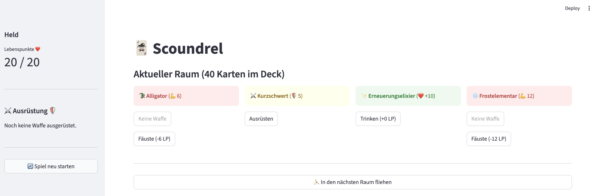

# Scoundrel 🃏

A Python implementation of the classic dungeon-crawling card game **Scoundrel**. 

Scoundrel is a roguelike solitaire game played with a standard deck of cards (minus the face cards). This project provides a robust game engine, a Command Line Interface (CLI), and a modern Web UI powered by Streamlit.

[](https://github.com/HazardDede/scoundrel/actions/workflows/ci.yaml)

---

## 📜 The Rules

Before you start your adventure, you should familiarize yourself with the mechanics. The game is about risk management, knowing when to fight, and when to flee.

> **Original Rules:** [Download the Scoundrel PDF](http://www.stfj.net/art/2011/Scoundrel.pdf) by Zach Gage and Kurt Bieg.

### Quick Summary:
* **Hearts (♥):** Health Potions (cannot be used consecutively for full value).
* **Diamonds (♦):** Weapons (used to slay monsters; their value determines protection).
* **Spades (♠) & Clubs (♣):** Monsters you must defeat.
* **Objective:** Get through the entire deck and reach the end with as much health as possible.


---

## 🚀 Installation

This project uses [uv](https://github.com/astral-sh/uv), an extremely fast Python package manager.

1.  **Clone the repository:**
    ```bash
    git clone https://github.com/HazardDede/scoundrel.git
    cd scoundrel
    ```

2.  **Install dependencies:**
    ```bash
    # This will create a virtual environment and install all dependencies
    uv sync
    ```

---

## 🎮 Playing the Game

### Streamlit Web UI (Recommended)
The most visual way to play Scoundrel. It features a modern layout and real-time game state updates.

```bash
uv run streamlit run scoundrel/ui/stream.py
```



### Console CLI (Experimental)
For the retro, terminal-loving dungeon crawler.

```bash
uv run python -m scoundrel.ui.cli
```

## ⚖️ License
This project is licensed under **CC BY-NC-SA 3.0**. 
See the [LICENSE](LICENSE) file for details. 
Original game design by Zach Gage and Kurt Bieg.


## 🛠 Developer Guide
We use Invoke to manage common development tasks.

Linting & Type Checking
Ensure code quality and type safety using mypy and pylint.

```bash
uv run invoke lint
```

Testing
We use pytest for unit tests and pytest-bdd for behavioral Gherkin-style testing to ensure the game rules are implemented correctly.

```bash
uv run invoke test
```

### 🏗 Project Structure

* `scoundrel/builders/`: Logic for generating and balancing various deck types (Standard, Beginner, Quick).

* `scoundrel/engines/`: The "Brain" – contains the game logic and rule enforcement.

* `scoundrel/themes/`: The CardAtlas system. Manages "World Themes" (e.g., Fantasy, Cyberpunk) by mapping card suits to specific names, lore, and icons.

* `scoundrel/models`: Core Pydantic data models for Cards, Player, and GameState.

### 🤝 Contributing

1. Fork the Project.

2. Create your Feature Branch (git checkout -b feature/AmazingFeature).

3. Commit your Changes (git commit -m 'Add some AmazingFeature').

4. Push to the Branch (git push origin feature/AmazingFeature).

5. Open a Pull Request.